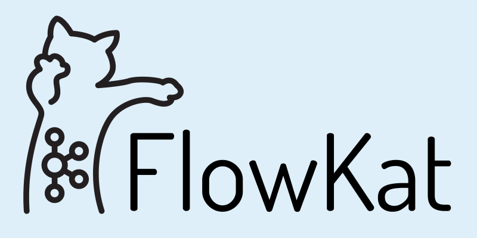

<p align="center">
 </p>
<h1 align="center"><strong>FlowKat</strong></h1></a>


<p align="center">An open source tool for inspecting the flow of your Kafka messages</p>

<p align="center">
  
  
  
  
   
</p>

## Table of Contents

* [Features](#features)
* [Demo](#flowkat-demonstration)
* [Installation](#installation)
* [Team FlowKat](#team-flowkat)
* [License](#license)

## Features
* ### Read Messages from your Kafka Topics
* ### Simple GUI that's easy to follow
* ### Connect Your Prometheus Instance for metrics

## FlowKat Demonstration
<p>To be added!</p>

## Installation
- FlowKat relies on KafkaJS in order to aggregate messages and Prometheus to graph metrics; if Prometheus is not hooked up to your Kafka Cluster instance, FlowKat should still be able to deliver compilated messages
- Clone this repo: ````https://github.com/oslabs-beta/flowkat.git````
- Run the following commands in the root folder:
  - ````npm install```` 
  - ````npm run watch````
  - ````npm run package-win```` or ````npm run package-linux````
- Open FlowKat
- Enter the port address for your Kafka broker and (optionally) your Prometheus instance to have FlowKat retrieve messages and metrics


## FlowKat Engineering Team
[Matt von der Lippe](https://github.com/mvdlippe)
| [George Zhao](https://github.com/iSaySureWhyNot)
| [Jorge Espinoza](https://github.com/jespin457)

We welcome contributions, so please feel free to fork, clone, and help FlowKat! Remember to leave a [](https://github.com/oslabs-beta/flowkat/).

## License
Released under the MIT License
